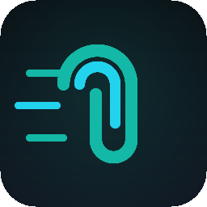

# QuickClip

<p align="center">
  
</p>

<p align="center">
  <b>A fast Windows clipboard manager with OCR and link previews.</b><br>
  Every copy is saved. Press <code>Ctrl+Shift+V</code> to search, filter, paste.
</p>

---

## What it does

- **Clipboard history** — Every text, image, or URL you copy is saved locally (last 500, configurable). Nothing leaves your machine.
- **Quick-paste window** — Global hotkey (`Ctrl+Shift+V` by default) pops a compact panel at your cursor. Arrow keys + Enter to paste.
- **Fuzzy search** — Live search across history with [fuse.js](https://www.fusejs.io/). Also searches OCR text and link titles.
- **Image OCR** — Copy a screenshot, QuickClip extracts its text in the background ([tesseract.js](https://tesseract.projectnaptha.com/), English + Malay). Search "invoice" and find the receipt.
- **Link previews** — Copy a URL, QuickClip fetches `og:title`, description, and preview image. Rich card preview.
- **Auto-categories** — Items are tagged as `code`, `url`, `email`, `phone`, `image`, `file`, or `text` based on regex heuristics.
- **Pin items** — Star important snippets so they stay at the top and don't get trimmed.
- **System tray** — Runs quietly in the tray. Right-click for open, clear, settings, quit.

## Install

```powershell
git clone https://github.com/Vexccz/quickclip.git
cd quickclip
npm install --ignore-scripts
npx electron-rebuild -f -w better-sqlite3
```

> **Why `--ignore-scripts`?** `better-sqlite3` ships native bindings for the stock Node ABI, but Electron uses its own. `electron-rebuild` recompiles it for the Electron version we ship.

## Run

### Development

```powershell
npm run dev
```

Opens Vite on port 5173 and launches Electron in dev mode. Copy anything (text, screenshot, URL) and the hotkey opens the quick-paste window.

### Build installer

```powershell
npm run dist
```

Produces `dist/QuickClip Setup 0.1.0.exe` (NSIS installer, x64).

## Keyboard shortcuts

| Shortcut | Action |
|---|---|
| `Ctrl+Shift+V` | Open quick-paste (global, configurable) |
| `↑` / `↓` | Navigate list |
| `Enter` | Copy selected item back to clipboard |
| `Esc` | Hide quick-paste window |
| `Ctrl+P` | Pin / unpin selected |
| `Ctrl+Del` | Delete selected |
| `Ctrl+,` | Open settings |

## How it works

| Layer | Stack |
|---|---|
| Shell | Electron 32 + TypeScript |
| UI | React 18 + Vite 5 + Tailwind CSS 3 |
| Storage | `better-sqlite3` at `%APPDATA%/quickclip/history.db` |
| OCR | `tesseract.js` (eng + msa language packs, lazy-loaded on first image) |
| Clipboard watch | Electron's `clipboard` API polled every 500ms with SHA-1 deduping |
| Hotkey | Electron `globalShortcut` |
| Link preview | `node-fetch` v2 reading bounded HTML for `og:*` / `<title>` |
| Packaging | `electron-builder` → NSIS `.exe` |

### Tech choices

- **Polling vs event-based clipboard:** `clipboard-event` depends on a native helper binary. Polling every 500ms with content hashing is simpler, fully cross-platform, and imperceptible in practice. If you copy faster than 2/sec you probably don't need history.
- **better-sqlite3:** synchronous, zero-config, easy transactions. JSON files would slow down as history grows.
- **tesseract.js:** runs entirely in-process, no external binary. First image triggers a ~10MB language-pack download (cached after).

## File layout

```
quickclip/
├── build/                  # app icon
├── scripts/
│   └── make-icon.cjs       # generates build/icon.png programmatically
├── src/
│   ├── main/               # Electron main process (CommonJS build)
│   │   ├── main.ts         # app lifecycle, windows, tray, IPC, hotkey
│   │   ├── clipboardWatcher.ts
│   │   ├── db.ts           # SQLite schema + queries
│   │   ├── ocr.ts          # tesseract.js worker manager
│   │   ├── linkPreview.ts  # og:* fetcher
│   │   └── preload.ts      # contextBridge exposing window.quickclip
│   ├── renderer/           # React app (ESM bundle via Vite)
│   │   ├── quickpaste.tsx  # quick-paste window
│   │   ├── settings.tsx    # settings window
│   │   ├── components.tsx
│   │   ├── Logo.tsx
│   │   └── styles.css      # Tailwind entry
│   └── shared/
│       ├── types.ts        # ClipItem, Settings, preload API
│       └── category.ts     # regex-based auto-tagging
├── tsconfig.json           # renderer
├── tsconfig.main.json      # main + preload
├── vite.config.ts
├── tailwind.config.js
└── package.json            # electron-builder config lives here
```

## Screenshots

*Coming soon.* (Run `npm run dev`, copy a screenshot, press `Ctrl+Shift+V`.)

## Troubleshooting

**`better-sqlite3` build errors on install.**
The package tries to compile for stock Node. Install with `--ignore-scripts`, then run `npx electron-rebuild -f -w better-sqlite3`. If you still see errors, make sure Visual Studio Build Tools (C++ workload) are installed.

**Hotkey doesn't register.**
Another app has claimed it. Change the hotkey in Settings. `Ctrl+Alt+V` is a common fallback.

**OCR is slow on first image.**
Tesseract downloads ~10MB of language data on first use. Subsequent recognitions are fast.

**Image clipboard paste back is plain (no rich clipboard).**
Electron can write images to the clipboard, but some apps prefer `CF_DIB` over `CF_PNG`. For most apps (Word, Paint, browsers, Discord) this works fine.

## Roadmap

- Rich file drag-out (currently file paths paste as text)
- Cloud sync (opt-in, end-to-end encrypted)
- Snippet templates with variables
- Per-category hotkeys

## License

MIT © Vexccz
